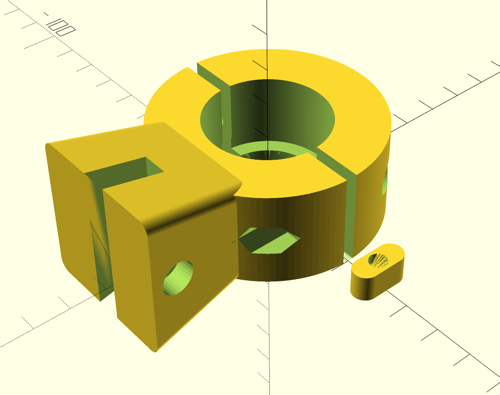
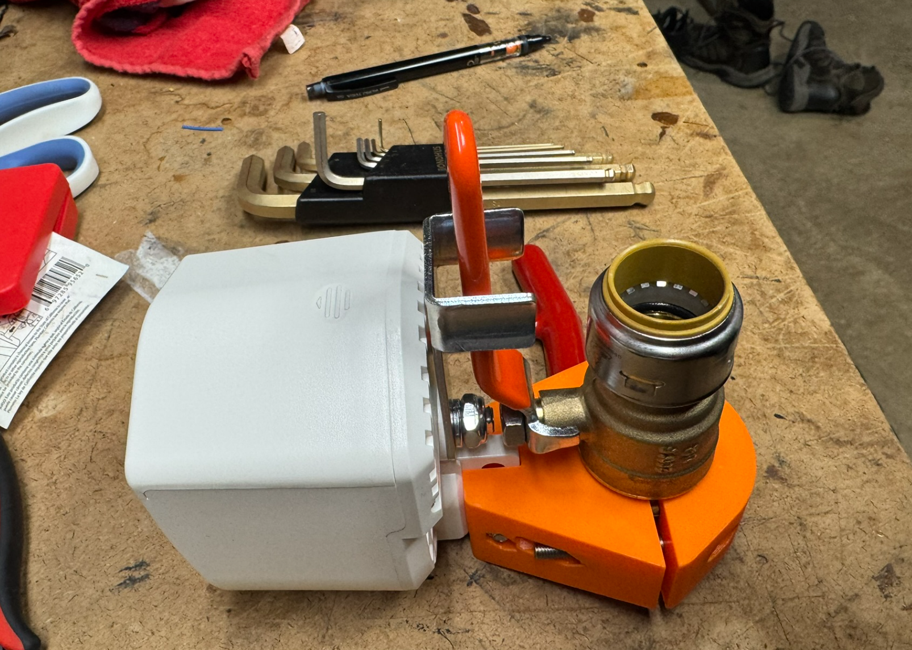
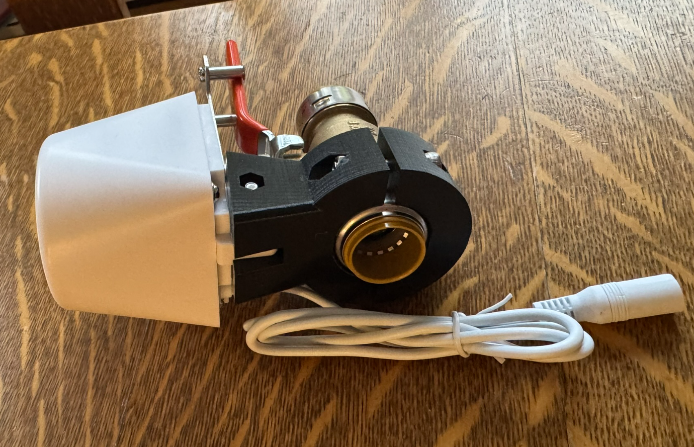

# Aqara T1 Valve Controller Mount

The [Aqara T1 Valve Controller](https://us.aqara.com/products/valve-controller-t1?srsltid=AfmBOoqY8_ugod5owPfjZAhMKLAppVGNp1EPUJe-erywH94czYdjkrGF) is an affordable motorized water shutoff valve whose [mounting bracket](https://us.aqara.com/cdn/shop/files/AqaraValveControllerT1_20.webp?v=1732710054&width=1200) is widely regarded as its weakest component. [Many Amazon reviewers](https://www.amazon.com/gp/customer-reviews/R2XOU6VDMNO59K/ref=cm_cr_dp_d_rvw_ttl?ie=UTF8) cite the included bracket as the device’s Achilles heel, while [users in the Reddit r/Aqara community](https://www.reddit.com/r/Aqara/comments/1lyy8m7/any_tips_on_securing_the_t1_valve_controller/) as well as [Aqara forums](https://forum.aqara.com/t/aqara-water-valve-t1-mounting-brackets/63853/2) frequently discuss the need for a more robust mount design. Details regarding the T1 can be found [here](https://smarthomescene.com/reviews/aqara-t1-water-gas-valve-controller-review/).

The [Tuya Valve Control](https://www.amazon.com/Motorized-Watering-Electric-Controller-Automatically/dp/B0851DYWBH) has a mount that is eerily similar to the Aqara. Buyers report that this product has a solid design with the exception of the metal mounting bracket. Why not create a mount that can be used for both products? [I did](doc/tuya.png).

Next will be rigorous tests for both using a Home Assistant script that opens and closes these valves at random intervals between 1 and 3 minutes.  Let's see which one dies first.  Perhaps I should add the Bulldog to the mix?

This project provides the Aqara and Tuya controllers with a sturdy mount that:

1. Attaches to the valve body and not the pipe.  This is consistent with [plumbing best practices](https://m.media-amazon.com/images/I/61tk9mOD39L._AC_SL1200_.jpg).  
2. Incorporates a C-clamp design that mitigates twisting during operation.  This is even more foolproof and customizable than the one offered on [the EcoNet Bulldog](https://m.media-amazon.com/images/I/61tk9mOD39L._AC_SL1200_.jpg).    
3. Fits a [large variety of valves](doc/valves.png). 
4. Brings the Zigbee-based Aqara and Tuya controllers on par with the Z-Wave-based [EcoNet Bulldog](https://www.amazon.com/EcoNet-Controls-EVC200-HCSML-Friendly-Plumbing/dp/B07DJZCFBH) at one-third the price.

This repository has the following directories:

* src \-	OpenSCAD source for the T1 mount and the HA test script for 100 on/off tests  
* stl \-	various .stl files for different valve bodies for both the Aqara and Tuya controllers   
* doc \- 	installation instructions and other supporting documents (images).

Want your valve dimensions added to the collection? Send me your valve body measurements, a photo, and manufacturer’s make and model information to [fpgirard@gmail.com](mailto:fpgirard@gmail.com).  At some point, I will post instructions on what measurements are necessary.

